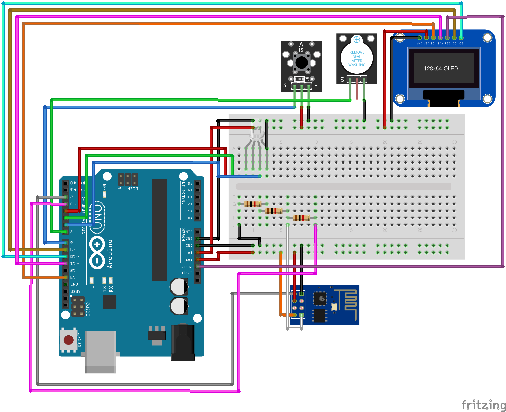

<!-- PROJECT LOGO -->
 

  <h1 align="center">TCP 통신 아두이노 모스부호 송수신기</h3>

<!-- ABOUT THE PROJECT --><!-- PROJECT SHIELDS -->

[![MIT License][license-shield]][license-url]
 
 
### 아두이노
* channel.h : network 에서 수신한 데이터를 부호로 변환하고 텍스트로 관리
* network.h : 서버 처리
* morse.ino : 메인파일, 버튼 입력 확인 및 ESP8266 초기화
### 서버
* server.cpp : 리눅스 기반 서버로 라즈베리파이에서 처리
### 문제
부호 수신시 자신의 패킷은 정상적으로 받지만 상대방의 패킷은 일부 손실되는 오류가 있다. 
TCP 세그먼트 오류로 생각되어 관련 코드를 작성해봤으나 잘 받다가 갑자기 아예 처리조차 안되서 
일단은 <s>귀찮아서</s> 중단한 상태이다.

## 회로도

  

## 결과물

  

<!-- CONTACT -->
## 문의

EpochFlow 팀 - epochflow@gmail.com

<!-- ACKNOWLEDGEMENTS
* [GitHub Emoji Cheat Sheet](https://www.webpagefx.com/tools/emoji-cheat-sheet)
* [Img Shields](https://shields.io)
* [Choose an Open Source License](https://choosealicense.com)
* [GitHub Pages](https://pages.github.com)
* [Animate.css](https://daneden.github.io/animate.css)
* [Loaders.css](https://connoratherton.com/loaders)
* [Slick Carousel](https://kenwheeler.github.io/slick)
* [Smooth Scroll](https://github.com/cferdinandi/smooth-scroll)
* [Sticky Kit](http://leafo.net/sticky-kit)
* [JVectorMap](http://jvectormap.com)
* [Font Awesome](https://fontawesome.com)
-->

<!-- MARKDOWN LINKS & IMAGES -->
<!-- https://www.markdownguide.org/basic-syntax/#reference-style-links -->
[license-shield]: https://img.shields.io/github/license/epochflow/Arduino-MorseCode?style=flat-square
[license-url]: https://github.com/epochflow/Arduino-MorseCode/blob/master/LICENSE.txt
